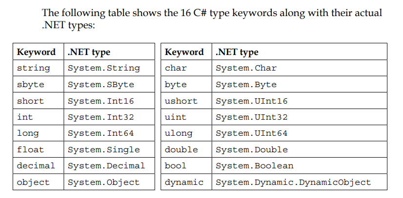
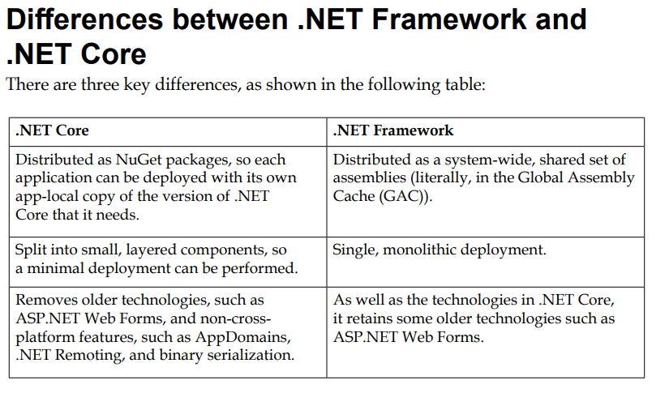

This chapter covers the following topics:
- Introducing .NET Core 3.0
- Understanding .NET Core components
- Publishing your applications for deployment
- Decompiling assemblies
- Packaging your libraries for NuGet distribution
- Porting from .NET Framework to .NET Core

Some of the more important packages
- System.Runtime (Object, string, Int32, Array)
- System.Collections (List<t>, Dictionary<TKey, TValue>)
- System.Net.Http (HttpClient, HttpResponseMessage)
- System.IO.Filesystem (File, Directory)
- System.Reflection (Assembly, TypeInfo, MethodInfo)

Press F12 to go to definition. You may notice the namespace and assembly names differ.

There are three ways to publish and deploy a .Net Core application. There are:
- Framework-dependent deployment (FDD)
- Framework-dependent executables (FDEs)
- Self-contained (includes .Net Core)

You can use the RID (Runtime IDentifier) catalog to identify currently supported values.

To build and release code as a `nupkg` file do the following:
- `dotnet build -c Release`
- `dotnet pack -c Release`

#### Exercise 7.1
1. What is the difference between a namespace and an assembly? Namespace is a grouping of code whereas the assembly is the output .dll filename
2. How do you reference another project in a .csproj file? You add a package reference block with the package name and version
3. What is the difference between a package and a metapackage? Give an example of each. A package is a singular package whereas a metapackage like ASP.Net Core is a collection of packages (it has many dependencies)
4. Which .NET type does the C# float alias represent? `System.Single`
5. What is the difference between the packages named NETStandard.Library and Microsoft.NETCore.App? .NetCore is an implementation of .Net Standard and designed to run on multiple platforms
6. What is the difference between framework-dependent and self-contained deployments of .NET Core applications? self-contained will include .Net Core whereas framework-dependent will require the host (or the deployment environment) to already have .Net configured
7. What is a RID? Runtime Identifier e.g. `win10-x64`
8. What is the difference between the dotnet pack and dotnet publish commands? pack will package everything into a `.nupkg` file and publish will prepare the code for deployment (incl dependencies).
9. What types of applications written for the .NET Framework can be ported to .NET Core? Any non legacy applications. Web forms, Windows Communication Foundation and Silverlight applications are not supported.
10. Can you use packages written for .NET Framework with .NET Core? If they only require .Net Standard APIs then yes.